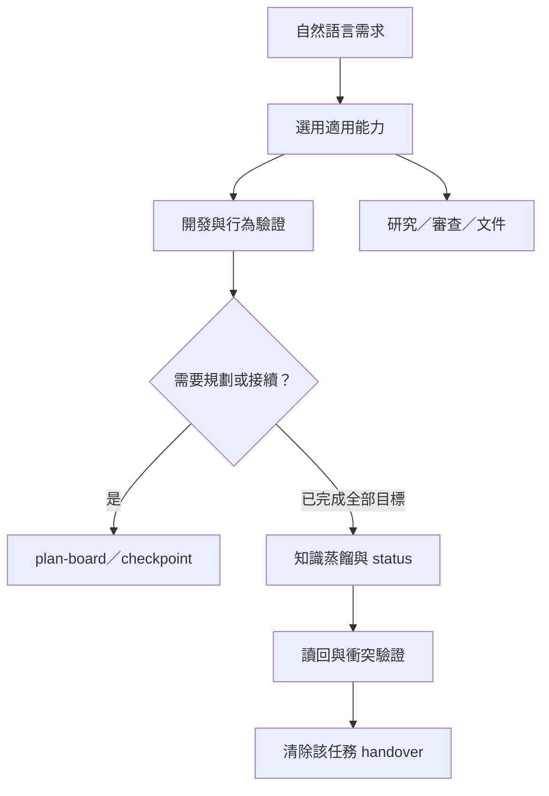

# Aget Work

以目標、驗收證據與必要邊界支援開發，讓模型按情境選用能力。直接提出需求，不需要每次先執行 setup-work。

- 30 個 skills：開發、規劃、研究、審查、測試、文件與知識管理。
- 5 個選用 Agents：獨立閱讀、code／spec 審查、測試、記憶整理。
- 移除 10 個重複 commands 與 3 個 PowerShell 實作。
- Node 核心：setup、plan-board、checkpoint／finalize、事件備援與 DOCX 打包；不新增 runtime 管理器、事件資料庫或評分服務。

永久規範保留穩定邊界；委派或跨 session 時，以 [Execution Brief](skills/start-work/references/execution-brief.md) 提供精確任務資訊。保留 AC 追溯、專業方法與實際驗收，執行批次及模型分工依任務決定。

## 使用

Node.js >=18。在本工具庫執行：

```sh
node scripts/setup-work.mjs --target /absolute/project --platform both
```

更新用同一命令，檢查加 `--check`；需要事件備援時加 `--hooks`。這只安裝到指定專案，保留原規範與其他工具。也提供 Claude／Codex plugin manifests；原生 plugin 與 setup skill 發現方式擇一，避免重複載入。宿主信任与新 session 載入仍由宿主處理。

[完整使用與 JSON 介面](docs/runtime.md) · [全工具責任映射](docs/tool-design-audit.md) · [紀錄生命週期](docs/recording-lifecycle.md) · [驗證狀態](docs/validation.md)



## 驗證

```sh
npm test
npm run check
```

實際測試範圍與宿主限制記錄在 validation；fixture 不等於模型端到端驗證。第三方文件 helpers 與授權保留在各 skill 中，技術依賴順序不視為不必要流程。不得把 `setup` 成功當成所有平台已通過驗收。
