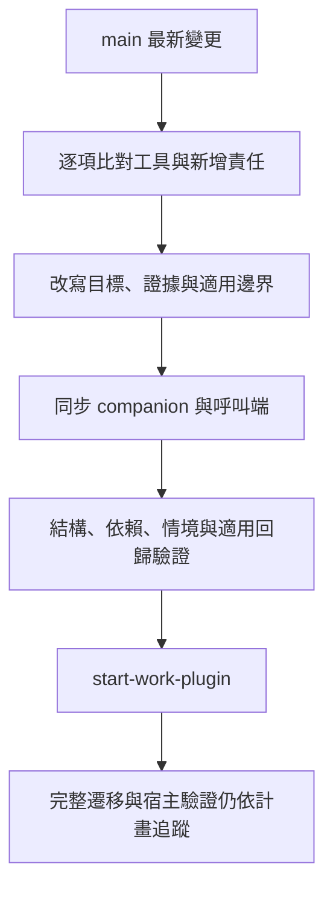

# main 整合與工具調整

核對日：2026-09-12。`git fetch origin --prune` 及 `git pull --no-rebase origin main` 成功；遠端 main 為 `f23efe4`，本地 main 已快轉到相同版本，start-work-plugin 原有 merge `d61b66f` 已包含它。本次上游差異是 5 個既有檔案、46 行新增，沒有新增公開工具。盤點仍為 33 skills、10 agents、10 commands。

## 本次已完成的調整

| main 更新 | start-work-plugin 保留的責任 | 移除的限制 |
|---|---|---|
| agents/code-reviewer.md | 指定範圍的獨立唯讀審查、SA 追溯、證據與限制 | 固定模型、單 AC 必派、最低缺陷數、分數、唯讀 Agent 寫檔 |
| skills/review-checklist/SKILL.md | 現行核准 SA → spec → 實作，適用順序／欄位／訊息／驗收 | 固定審查步驟、規格問題阻止所有其他審查、指定修正角色 |
| skills/review-checklist/report-template.md | 來源版本、具體缺陷、未驗證項目與完成判斷 | 分數公式與最低三個候選缺陷 |
| skills/error-first-debug/SKILL.md | 真實根因、timeout／完成狀態、合理替代路徑與回歸證據 | 讀碼前置禁令、窮舉全部路徑、無條件提高 timeout |
| skills/error-first-debug/root-cause-patterns.md | 索引／hint／截尾／新舊行為的查證方法 | 對不存在業務文件與 HARD RULE 編號的依賴 |

同步調整 review-checklist 的兩份 companion 適用範圍、review-change 的唯讀契約，以及 start-work 中 reviewer 分數和磁碟報告的呼叫假設。start-work 其他舊流程仍待整體遷移，不把這次相容修正標成完整改寫。

## 納入整體計畫的完成目標

- 所有現存工具的處置與責任位置見 [全工具審查](tool-design-audit.md)。本次上游新增的驗收責任已實際落地於上表，不另新增同義工具。
- setup-work 只負責設定／更新／修復；自然需求由 start-work 判斷需要的能力與規劃程度，保留目標驗收並取消固定派工。
- ask-arxiv 作為研究需求的獨立 skill，偏好近期論文，區分研究證據、限制與本專案推論；仍待整合。
- PowerShell 改用 Node.js，包含 board、hook 與呼叫端，保留必要鎖與 hash；尚未完成的移植不能只改副檔名。
- 記錄事件共用 Node 核心，暫停／idle／compact／clear 不等於任務完成；完成後知識蒸餾、來源與 status 讀回驗證成功才刪除該 handover，見 [生命週期](recording-lifecycle.md)。這些 runtime 尚未實作。

## 本次驗證結果

- 兩份修改 skill 的官方 quick_validate 通過；PyYAML 只安裝於暫存目錄。
- 修改及新文件的相對 Markdown 連結檢查通過；53 個公開工具全數存在於審查清冊。
- Git ancestry 驗證通過：origin/main 是開發分支祖先；本地 main 與 origin/main 相同。
- Node hook 隔離 smoke 5 案通過：大小寫匹配、錯誤 JSON、scope 不符、空專案、Vue／Node stack 偵測。沒有接觸真實 vault 或主機設定。
- `git diff --check` 通過。

文件情境覆核（人工契約檢查，不冒稱模型端到端測試）：

| 情境 | 覆核结果 |
|---|---|
| 實作與 spec 相同，但 spec 顛倒 SA 畫面順序 | 契約要求回報 spec 落差，不能判需求通過 |
| 純技術重構沒有 SA | 記不適用理由，不阻止工作；應有而未取得則列缺口 |
| 300 秒 timeout 被截斷 | 保留觀測時間及逾時狀態，不宣稱完整耗時或自動提高上限 |
| 有一個可行資料來源但無法確認其他來源 | 說明探索範圍／未量測，不宣稱唯一或要求無限窮舉 |
| 沒有日誌但可讀碼建立重現測試 | 可探索，未有證據不能宣稱根因確認 |
| 唯讀 reviewer 沒有執行／写入工具 | 回傳審查內容與證據限制，不假裝跑測試或存檔 |

上述通過範圍是這批 main 整合與文字契約調整。全部工具的 runtime、Node board 移植、記錄核心及 Claude／Codex 真實宿主觸發不在已通過之列。整體狀態以未完成項目持續追蹤，不能據此發布為完整可安裝版本。
