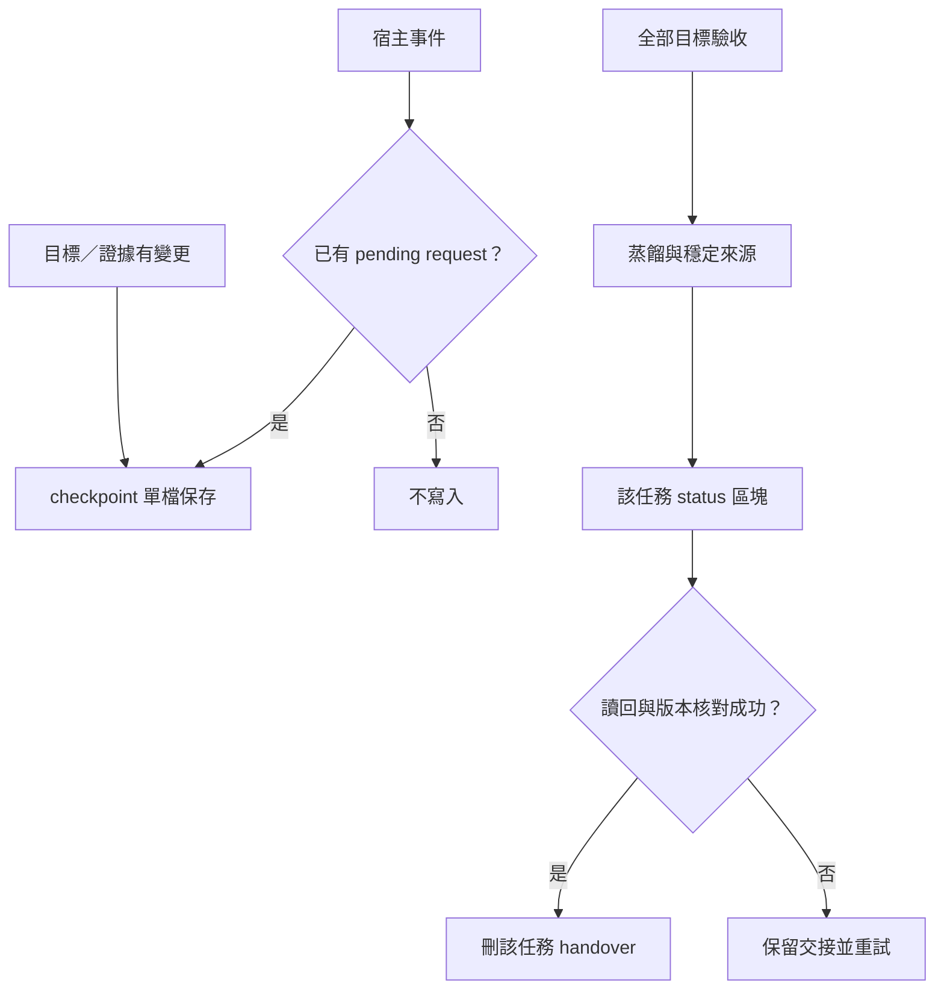

# 紀錄生命週期

Node 實作、介面與恢復方法見 [runtime](runtime.md)，測試結果見 [validation](validation.md)。

checkpoint 的目標是跨 Agent 可接續，finalize 的目標是完成且可安全移除交接。Session 結束、對話暫停與任務完成是不同狀態。所有事件共用 `hooks/record.mjs`，不新增事件專用 Agent。

| 時機 | 保存方式與邊界 |
|---|---|
| 有意義里程碑 | 模型立即 checkpoint，保存全目標、證據、決策及下一步 |
| 明確暫停任務 | paused checkpoint，保留未完成與恢復條件 |
| 回覆／等待／中斷 | 宿主支援事件 flush 已整理的 pending request |
| compact／clear／結束 | 僅補存現有 request，不能退出時才生成摘要 |
| 子任務結束 | 不推導全案完成 |
| 全部目標驗收 | 正常工作 finalize：蒸餾、來源與 status 驗證成功才刪 handover |

Pending 每個 session 一條任務，切換前先 flush，跨任務覆蓋會被拒絕。相同 checkpoint 不重寫。延遲的 completed request 會降為 active／未知在途，避免沿用過期完成判斷。事件沒有 request 就無寫入，不掃 transcript、不呼叫模型，不阻擋退出或觸發反覆 Stop。

結案三種蒸餾結果：new 保存新知識與來源；existing 連回既有知識；none 在 status 說明無新知識理由。全目標 pass、有實際證據、inflight 已知為空；只有測試 exit 0 不足以宣稱完成。機器檢查資料一致性，模型仍負責判斷驗收與蒸餾內容。

鎖、hash、路徑白名單與來源讀回保留；不做向量資料庫、多層 config、固定 evaluator 或 metrics 門檻。知識庫提供上下文與可接續狀態，搭配真實驗證及受限寫入形成部分 harness，不能單靠 Markdown 保證語意正確。

Codex／Claude 事件及信任處理依官方與實際版本分開驗證，見 runtime。既有 vault 先採用 rules/memory-contract.md 的明確 checkpoint／finalize 契約，不將舊版 handover-only 模式默默擴為 durable 寫入。
