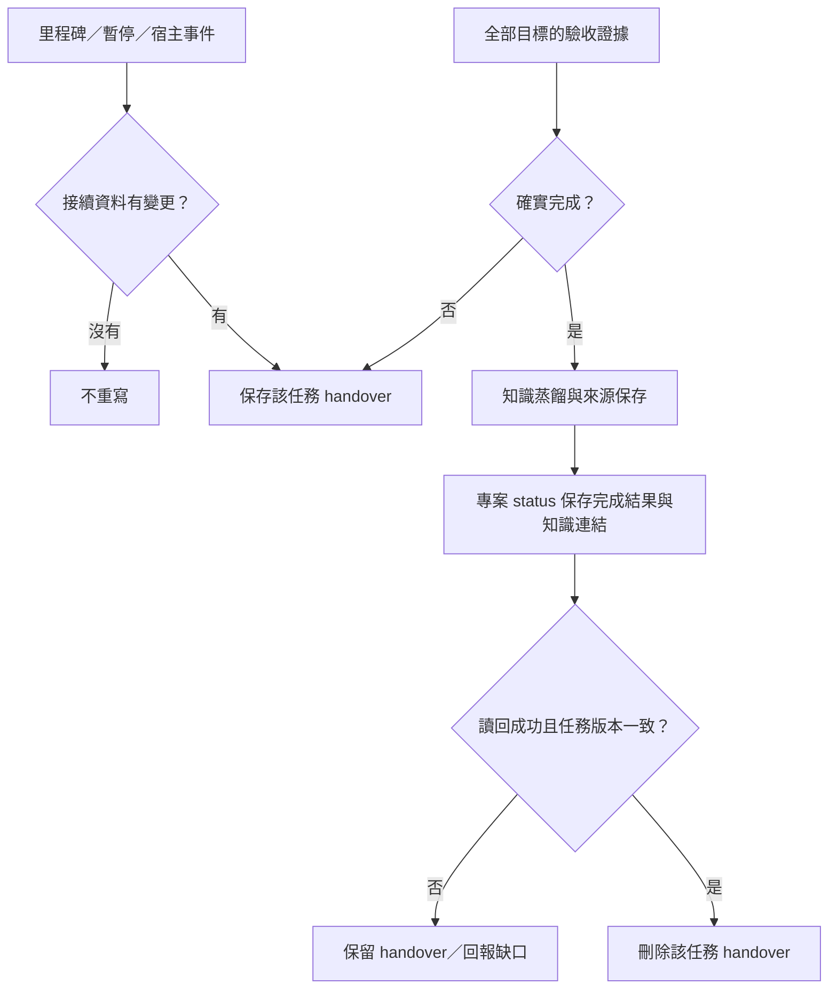

# 紀錄生命週期與工具精簡計畫

修訂：2026-09-12。適用分支：start-work-plugin。狀態：設計契約，尚未實作或安裝紀錄 hook。

## 完成目標

模型能自由選擇完成方法；工具保證接續資料可保存、完成證據不遺漏，以及結案資料保存成功前不刪交接。Skill 與 Agent 使用「適用情境、完成目標、驗收證據、寫入邊界」描述責任，移除固定派工、固定模型、單一 AC 回合及無關確認。技術上的資料一致性依賴仍保留。

## 目前盤點

2026-09-12 執行 fetch 與 pull origin main：Already up to date。本分支 HEAD d61b66f 已包含 origin/main 的 f23efe4。來源仍為 33 skills、10 agents、10 commands、3 個 PowerShell 檔與 2 個 Node hook。settings 只接 PreToolUse 與 SessionStart；沒有暫停紀錄、結案蒸餾或安全刪除 runtime。不得將先前暫存改稿視為已落地功能。

## 紀錄時機與可驗收行為

Session 狀態與任務狀態分開：session 閒置不代表任務暫停；session 結束不代表任務完成。任務採 active／paused／completed；blocked 為未完成狀態及其原因。Hook 事件只提供訊號，不具備語意驗收權。

| 時機 | 可觀察訊號 | 應有結果 |
|---|---|---|
| 有接續價值的里程碑 | 模型已確認目標、決策、修改或驗證有變動 | 更新該任務 handover；不是每次工具呼叫都寫 |
| 使用者明確暫停整體任務 | 本次指示及模型理解 | 保存完成部分、未完成目標、阻塞、恢復條件，任務 paused |
| 回覆結束 | Stop | 有新 checkpoint 才保存；背景工作或排程存在時仍屬未完成；不自動結案 |
| 對話閒置／等待使用者 | Notification 的 idle_prompt、permission_prompt 等實際支援訊號 | 最多保存已有 checkpoint 與等待原因；不猜測使用者已放棄，不新增知識頁 |
| 即將壓縮 | PreCompact | 補存已有接續資料；與 /compact 的宿主摘要分開 |
| 清除或離開 session | SessionEnd，包含 clear | 短時間補存已有 checkpoint；不在退出期間呼叫 LLM 寫新摘要、蒸餾或刪 handover |
| 子任務完成 | TaskCompleted／SubagentStop（宿主支援時） | 僅更新对应子目標的 evidence，不推導全案完成 |
| 全部目標驗收完成 | 目標與驗收證據完整、無剩餘工作及相關在途任務 | 進入結案：蒸餾、status 保存確認、該任務 handover 清除 |

Claude 官方文件核對日 2026-09-12：Stop 可提供 background_tasks／session_crons，缺欄位表示未知，不等於空。idle_prompt 有條件觸發，不是可靠的通用閒置計時器。TeammateIdle 專屬 team teammate。SessionEnd 無法阻擋終止。實裝版本需以 fixture 及隔離會話確認；Codex 不直接套用 Claude 事件名稱。未支援的宿主依靠模型里程碑交接，明列自動化缺口。[官方事件參考](https://code.claude.com/docs/en/hooks)

## 一個紀錄模組，兩種寫入責任

所有適配事件共用 Node.js 模組，不增加 pause-agent、idle-agent、蒸餾評分 agent 或常駐 idle daemon。Hook 不掃描整份 transcript 生成知識；模型在工作中產生精簡 checkpoint，hook 僅保存已提供的資料。只有事件而沒有摘要時標示 checkpoint 不完整，不虛構已保存。

- checkpoint：只更新選定的 workspace + task handover，遵循 vault 的單檔邊界。
- finalize：正常工作中的結案操作，允許更新指定專案 status、必要知識與來源，驗證後刪除對應 handover。不沿用 handover-only 模式的禁止 durable 寫入規則；遷移時同步更新 caller、honey、vault schema，避免契約矛盾。
- 去重使用 task identity 與 checkpoint revision／內容 hash；session ID 留作事件歸屬，同一 revision 的 Stop、idle、SessionEnd 不產生三份資料。無變更不重寫。紀錄錯誤留下精簡診斷，不能讓工作持續被 Stop hook 喚醒。
- 最小持久狀態沿用 Markdown handover；不另建與 handover 競爭的完整任務 JSON 正本。只有尚待寫入的 checkpoint 或失敗重試所需資料才暫存，成功後清除。

## 結案驗收：蒸餾與 status 成功才可刪除

「全部任務完成」指選定 handover 所涵蓋的全部目標，不是全機所有任務。共享 board 要涵蓋其全部目標及適用整合驗收；不得刪除其他 task、其他 session 的交接檔。

| 必要成果 | 驗收證據 |
|---|---|
| 目標確實完成 | 每項目標對應交付與實際驗證結果；未執行、blocked 或未知不能算通過；不能刪改目標來湊完成 |
| 已作知識蒸餾 | 對決策、根因、通用限制與可重用方法有明確判斷；新知識寫入適當頁，已有知識連回原頁。確無新增價值時在 status 記錄理由；不是只勾一個 distilled=true |
| 知識保存位置正確 | 通用知識入 knowledge；專案知識留對應專案／業務 vault。引用穩定來源，不引用即將刪除的 handover 作唯一證據；不搬 raw、不複製 transcript 或機密 |
| 專案 status 已落盤 | 記錄 task identity、完成範圍、驗證摘要、限制、知識頁與來源链接或無新增理由；只更新相應任務，不覆蓋其他工作線 |
| 可安全清除 | 同一任務寫入鎖＋預期 revision/hash、目標白名單、禁止 symlink 越界；任何衝突保留 handover，重新讀取判斷 |
| 中斷可恢復 | 知識及 status 已保存但刪除失敗時，重試不重複蒸餾；status 失敗時不刪；結案未完成標示 cleanup pending；不宣稱跨檔案原子交易 |

刪除前重新讀回 status、知識來源鏈與目標 handover，核對保存及一致性。這是防止資料遺失的依賴關係，不是限制模型如何開發的 SOP。不要靠讀取 handover、檔案年齡、結尾一句「完成了」或測試 exit 0 自動刪除。無需為已授權的結案再問例行確認；資料衝突或目標不明時才處理具體缺口。不預設自動 commit／push。

## 過度設計檢查與縮減決策

有過度設計風險：舊流程把派工、確認、rubric 分數、單一 AC 回合固化；新提案又同時引入多層 config、私有 Node runtime、版本切換、metrics、board 及多平台適配。把它們一次做成日常必備，會抵消精簡收益。

| 保留 | 合併或延後 |
|---|---|
| 目標、範圍、驗收證據與真實測試 | 不新增專屬路由／評分服務；不要求固定缺陷數或固定模型 |
| 專業 skill 的方法與 API 參考 | 移除重複 command 包裝與跨檔強制交棒；不把所有專業內容硬塞 start-work |
| 任務 handover、來源鏈、結案蒸餾 | pause／idle／end 共用紀錄核心，不各自一個 skill |
| 避免競爭覆寫的鎖與版本檢查 | 不建完整事件溯源資料庫或訊息佇列 |
| 必要 scope、vault 路徑與現有 Node 檢查 | 多層遞迴 config、私有 runtime 管理、完整 rollback 平台延後，待部署需求證明必要 |
| 有共享依賴時才用 board | 不替簡單工作建 board，不固定增加 INTEGRATION 角色 |
| 可選的專業 Agent | 未有獨立 context 或工具權限需求的角色合併；不能僅靠 description 宣稱一定觸發 |
| 基本知識導航、來源、鮮度 | 不預設向量資料庫、知識圖譜或每回合全庫檢索；metrics 不作結案必填 |

知識庫目前是 context 與接續狀態層。搭配真實驗證回饋及受限寫入才構成部分 harness；Markdown 不能自行保證語意完成。精簡成效以目標漏項、誤結案、重複紀錄、越界寫入與接續成功率驗收，工具數只是次要指標。

## 實作完成判準

- 已有成功 checkpoint，Stop→idle→clear 只保存一次同版本；純問答不建立工作 handover。
- 背景任務尚存、未知任務狀態、未通過 AC、只完成子任務皆不得結案。
- 明確暫停後另一個 Agent 可由 Markdown 找到 scope、證據、未完成項與恢復條件。
- 無效／重複／不支援事件不修改 durable 資料，不觸發無限 Stop 迴圈。
- 有新增知識、已存在知識、無新增知識三種結案路徑均有可查證的 status 紀錄。
- 注入知識寫入失敗、status 失敗、刪除失敗、併發修改及重啟：不丟交接、不覆蓋其他任務、不重複寫知識。
- 刪除後知識來源連結仍有效；其他任務的 handover 與專案 status 內容保留。
- Node 單元／檔案整合測試與 Claude／Codex 實際宿主接續測試分開報告；未支援事件不能標示通過。

本文件新增到分支不等於上述功能已實作。PowerShell 改 Node 的既有遷移仍未完成；runtime、caller、fixture 同批遷移後才刪舊實作。

全部工具逐項處置與附屬檔清冊：[全工具設計審查](tool-design-audit.md)。
